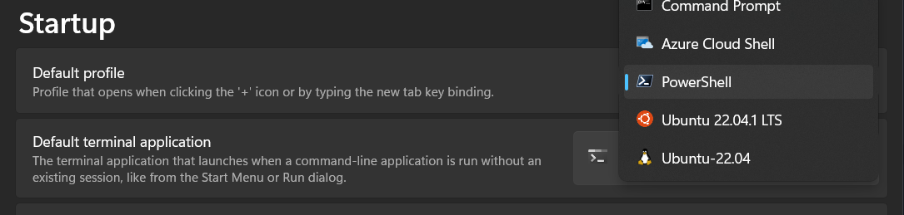
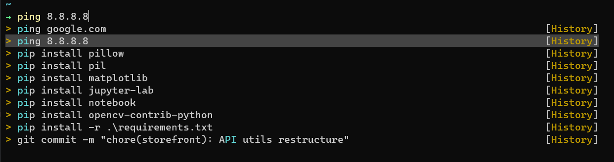

# Spice up your terminal game on Powershell

This is a fairly simple and straightforward step by step guide to setup Oh My Posh and few other usefull utilities on Powershell.

I'll not deep dive and explain what does what & why install something. You can do a simple google to find out that. Good luck!

If you are on Windows 10, you'll most likely want to do the following steps first,

- Install [Windows Terminal](https://apps.microsoft.com/store/detail/windows-terminal/9N0DX20HK701?hl=en-bd&gl=bd)
- Install [Powershell](https://apps.microsoft.com/store/detail/powershell/9MZ1SNWT0N5D?hl=en-bd&gl=bd)
- Set Powershell as the Default Profile of Windows Terminal

  - Open Windows Terminal
  - Hit `ctrl+,`



Rest is same for Win 10 & 11,

- Install a [Nerd Font](https://www.nerdfonts.com/font-downloads) of your choice
  > You can see preview of the fonts at https://www.programmingfonts.org/
- Set your newly installed font as the default of `Windows Terminal`
  > If you use terminal inside vscode, set value of `"terminal.integrated.fontFamily"` with your font
- Install [Oh My Posh](https://ohmyposh.dev/)
  ```powershell
  winget install JanDeDobbeleer.OhMyPosh -s winget
  ```
- edit Powershell profile $PROFILE and paste the following
  > Replace `user-name` with your Windows user name & `theme-name` with your preferred [theme](https://ohmyposh.dev/docs/themes) in the command
  > Run `code $PROFILE` to open in VSCode or `notepad $PROFILE` to open in notepad

```powershell
oh-my-posh --init --shell pwsh --config C:\Users\user-name\AppData\Local\Programs\oh-my-posh\themes\theme-name.omp.json | Invoke-Expression
```

- Install [Terminal-Icons](https://github.com/devblackops/Terminal-Icons)

```powershell
Install-Module -Name Terminal-Icons -Repository PSGallery
```

- Import Terminal-Icons in $PROFILE

```powershell
Import-Module -Name Terminal-Icons
```

- Install [PSReadLine](https://github.com/PowerShell/PSReadLine)

```powershell
Install-Module PSReadLine -AllowPrerelease -Force
```

- Import PSReadLine in $PROFILE

```powershell
Import-Module PSReadLine
```

- To get better list view and edit mode, paste the following in $PROFILE

```powershell
Set-PSReadLineOption -PredictionSource History
Set-PSReadLineOption -PredictionViewStyle ListView
Set-PSReadLineOption -EditMode Windows
```



**_You can edit and remove commands from powershell history by modifying `$env:APPDATA\Microsoft\Windows\PowerShell\PSReadLine\ConsoleHost_history.txt`_**

### Credits

- https://0xdf.gitlab.io/2018/11/08/powershell-history-file.html
- https://www.hanselman.com/blog/my-ultimate-powershell-prompt-with-oh-my-posh-and-the-windows-terminal
